# ETL Pipeline and Data Visualization Dashboard
## Amare Diotte
### Per Scholas Data Engineering 
### July 2027

### Workflow Steps
- Plan architecture of program

- Research library for front end Dashboard

- Read JSON Files with PySpark, get and process API request

- Transform Data with PySpark: Perform necessary transformations using PySpark.

- Convert Data to Pandas DataFrame: Convert the transformed PySpark DataFrame to a Pandas DataFrame for any further processing that is more convenient or efficient in Pandas.

- Load Data into MySQL with SQLAlchemy

- Research GUI options for python

- Implement Dashboard

- Create visualizations

- Combine visualizations and GUI

### Architecture
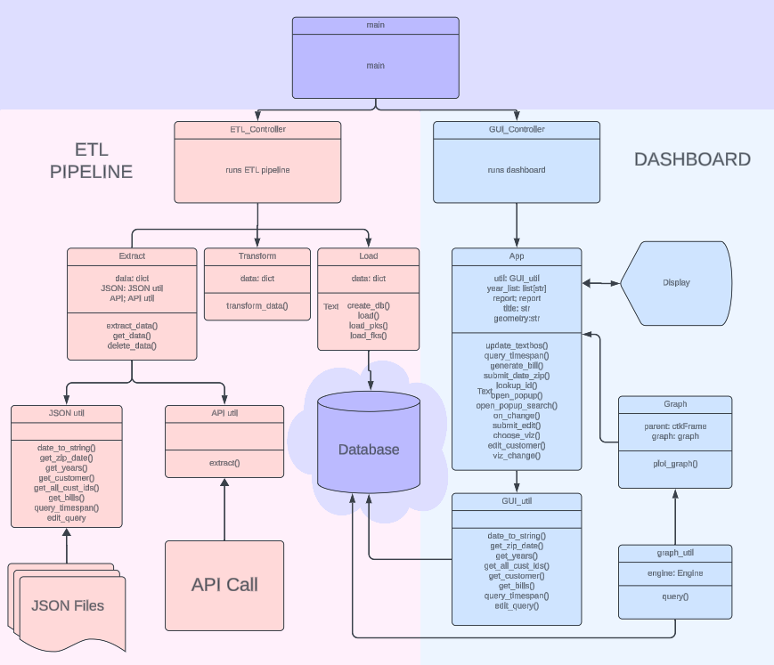

I could see how this was going to be a complicated program, I was communicating with a database, an api, and opening external documents. My program also had two distinct functions - ETL and displaying results - so I wanted to make sure I used separation of concerns when designing my program. I used the model view controller pattern to accomplish this. Only the model interacts with the data source and only the view interacts with the output. 

Once I figured out the overall design of the program, I started out planning my database by making an ERD diagram:

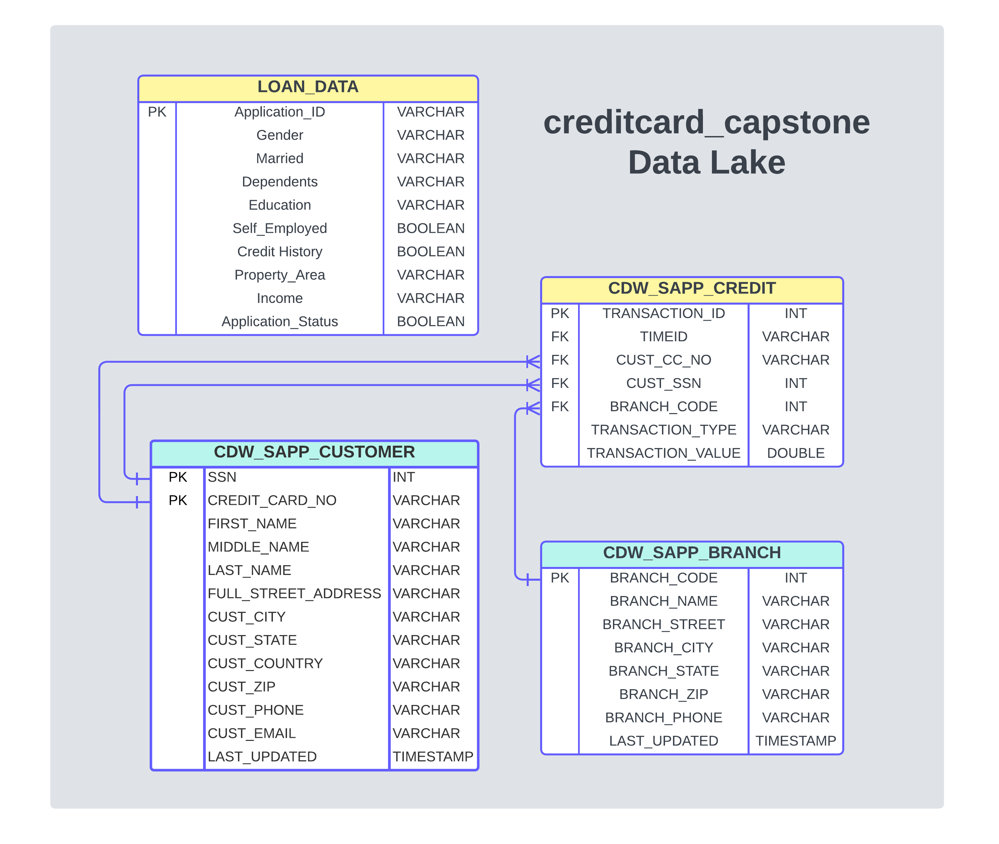

### Cleaning and transforming data
I created a ETL pipeline to clean and organize the data from the JSON files and API into a one database. I was given a mapping document with instructions on how to organize this text into tables. 
I made a couple changes to the proposed tables to normalize them:
- I removed the social security number column from the CDW_SAPP_CREDIT table, to get rid of duplicate data.
- I added a customer id to the CDW_SAPP_CUSTOMER table so that the SSN wouldn't act as a primary key. Where it's private information and has actual meaning to the data set, it's not a good candidate key
- The customer phone numbers did not have area codes. Where all the phone numbers of the branches are "123", I changed the customer numbers to have the same area code.

### Loading to a Database
Originally I used PySpark’s JDBC direct write to my database, but I was getting compilation warnings that advised using SQLAlchemy instead. SQLAlchemy allows better transaction management and I need to set keys and alter tables, so I found this suggestion helpful. it also allows you to Object-Relational-Mapping with the database you're connecting to. I would like to explore ORM when I have more time.

## Creating a Dashboard
I used the CustomTkinter library to build my Dashboard. I didn't have a lot of time to design the look of my UI so the color presets in this library made it a great option. Learning the grid layout system took some effort and some of the widgets are still a little buggy (DateEntry is pretty bad), but for the most part, it was easy to use and easy to make nice looking UI.

I split my dashboard into three tabs - Customers, Transactions, Viz

### Transactions Tab, Req 2.1 
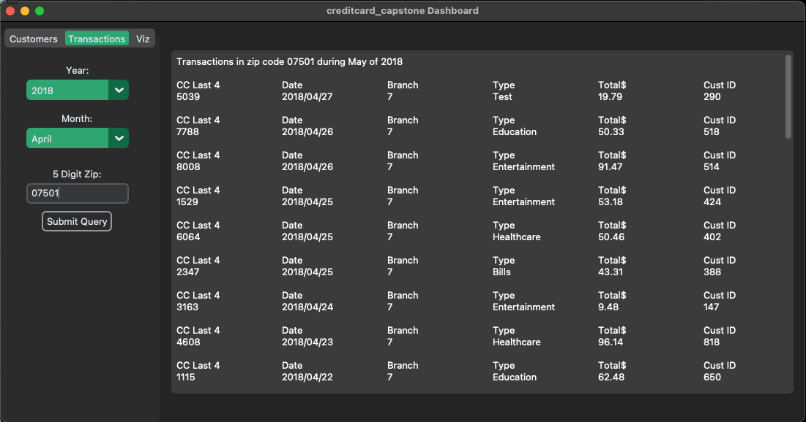
The user choses the year and month from the drop down menus and a 5 digit zip code in the entry box. Upon clicking the button, a query is run on the connected MySQL db returning up to date information on all transactions that occured in that zip code during that month. This data is parsed and formatted and displayed in the large text box in the dashboard.

### Customers Tab, Req 2.2
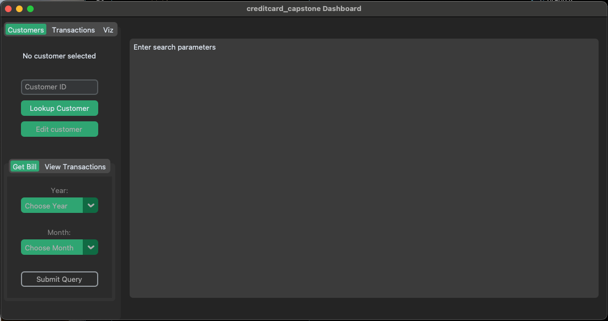
When you first get to the customer tab, the search functions are disabled because a customer must be chosen for this search.

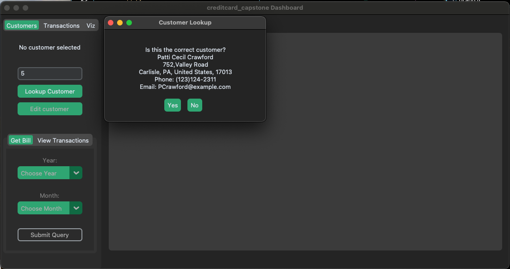
Enter a customer ID and hit the lookup customer button. A pop up will come up to confirm the individual is the correct person. Upon accepting, the customer is now selected and you can do the searches below.

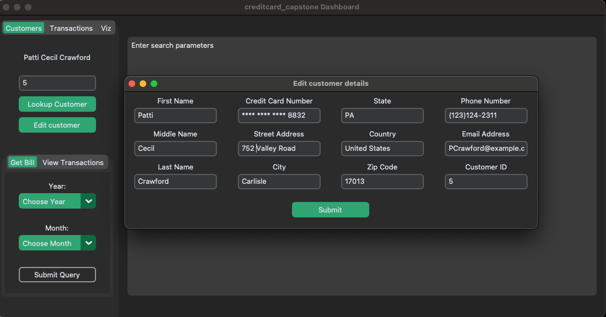
Hitting the edit customer button will bring up a new window where fields can be updated. Some of the fields are not able to be changed for security reasons - SSN, ID, credit card number. Only the last 4 digits of the card number are shown for security reasons as well.

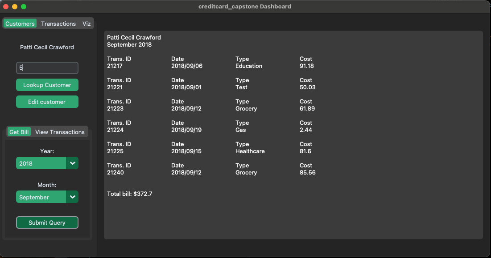
Under the Get Bill tab, you can select the year and month and get an itemized bill for the customer's transactions during that period.

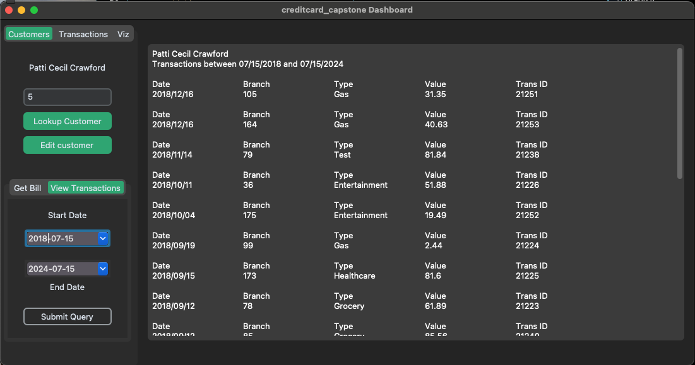
Under the view transactions tab, you can use the two calendar widgets to select your date range. Hitting the button will query the db for any transactions this customer made during that period of time.

### Visualizations Tab, Req 3
#### Calculate and plot which transaction type has the highest transaction count.
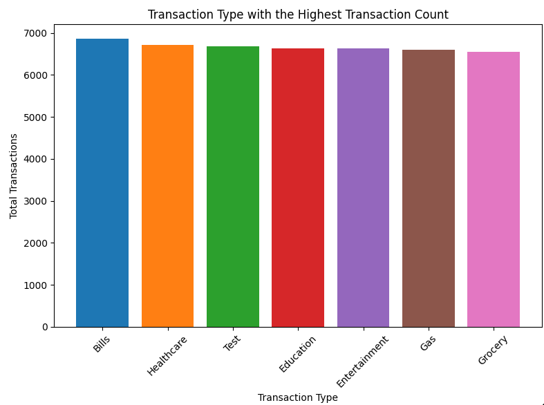

Bills are the transaction type that has the highest transaction count. 

#### Calculate and plot top 10 states with the highest number of customers.
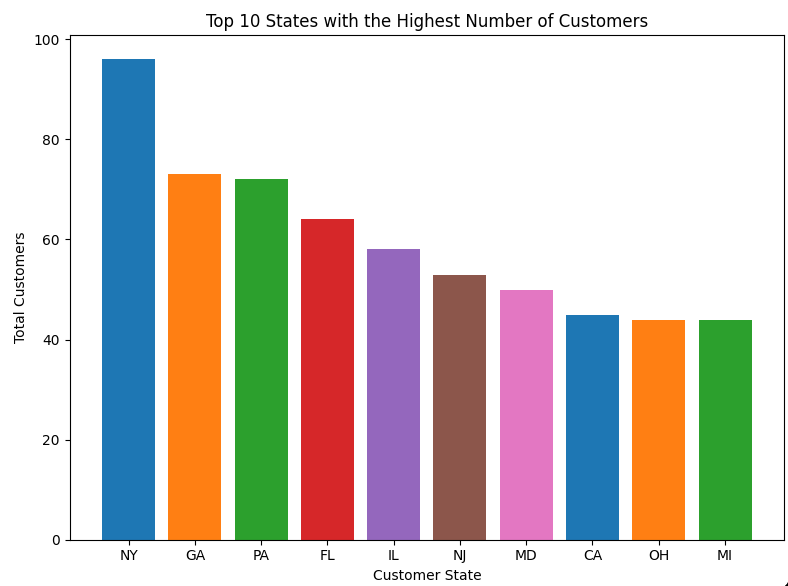

The states with the highest number of customers are:
1. New York
2. Georgia
3. Pennsylvania
4. Florida
5. Illinois
6. New Jersey
7. Maryland
8. California
9. Ohio
10. Michigan

#### Calculate the total transaction sum for each customer based on their individual transactions. Identify the top 10 customers with the highest transaction amounts (in dollar value). Create a plot to showcase these top customers and their transaction sums.
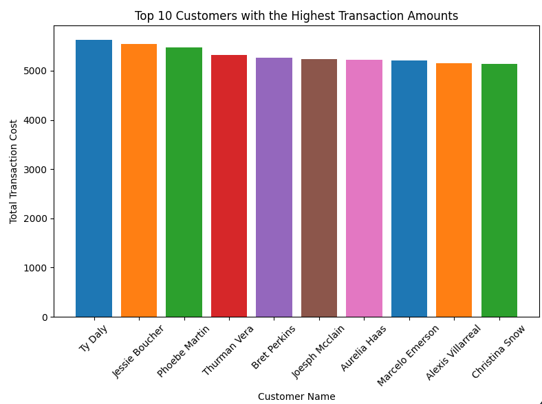

Most Valuable Customers:
1. Ty Daly
2. Jessie Boucher
3. Phoebe Martin
4. Thurman Vera
5. Bret Perkins
6. Joseph Mcclain
7. Aurelia Haas
8. Marcelo Emerson
9. Alexis Villarreal
10. Christina Snow

### Loan Application Data API, Req 4
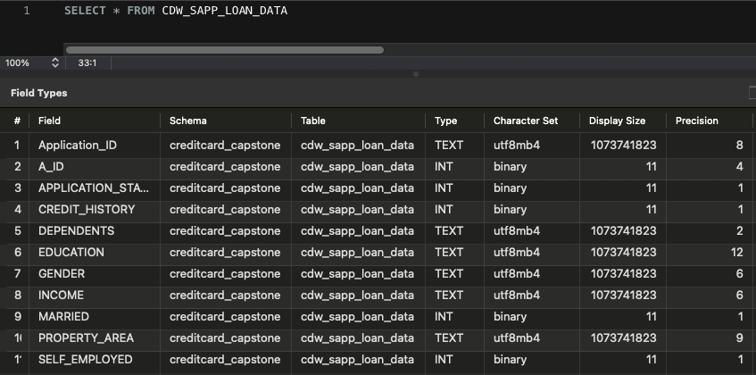

Loading the API data was much easier as it was contained in a single table and I didn't need to deal with any joins or foreign keys. There's no sensitive data that I need to hide in this table either. I added a new column and trimmed the strings from the "application_id" so I could have a primary key that is an int.

### Visualizations Part 2, Req 5
#### Calculate and plot the percentage of applications approved for self-employed applicants. Use the appropriate chart or graph to represent this data.
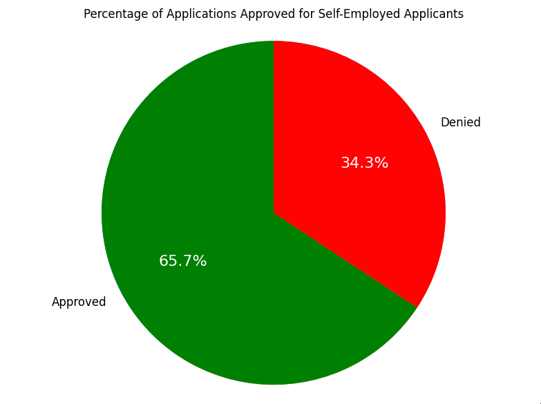

Significantly more self-employed people are approved for a loan than denied.

#### Calculate the percentage of rejection for married male applicants. Use the ideal chart or graph to represent this data.
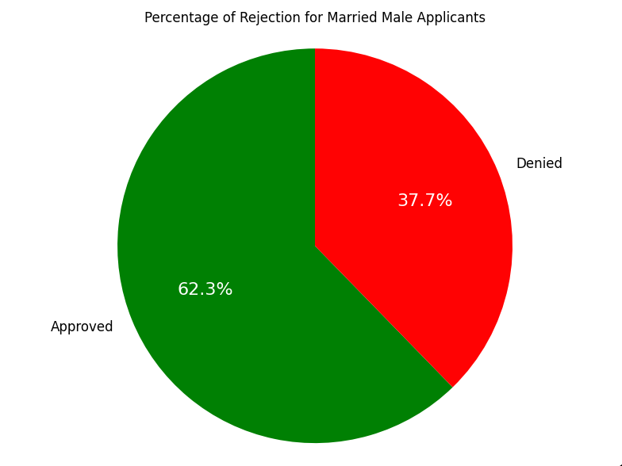

The majority of married male applicants were approved for the loan.

#### Calculate and plot the top three months with the largest volume of transaction data. Use the ideal chart or graph to represent this data.
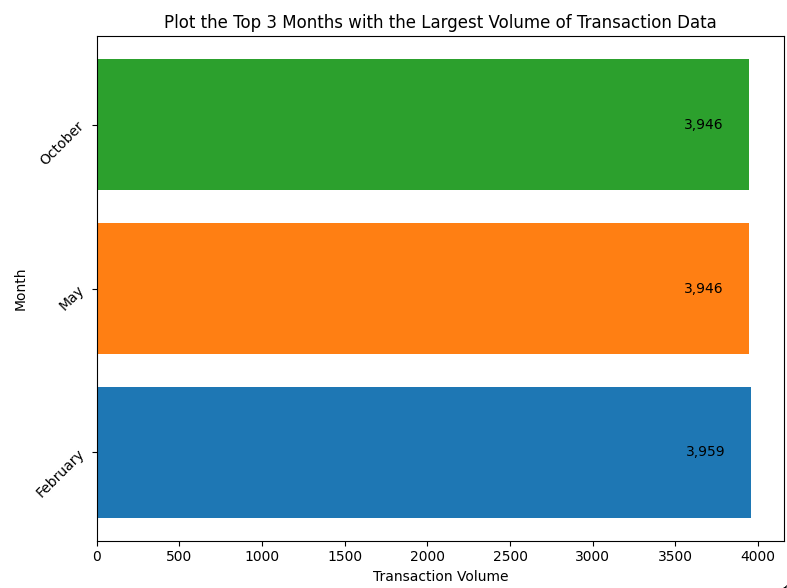

The months with the largest volume of tranactions are October, May, and February

#### Calculate and plot which branch processed the highest total dollar value of healthcare transactions. Use the ideal chart or graph to represent this data.
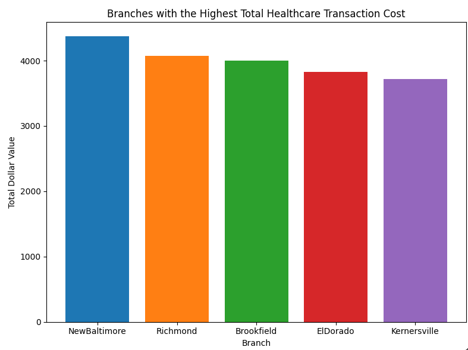

The branches with the highest total dollar value of healthcare transactions are:
1. New Baltimore
2. Richmond
3. Brookfield
4. El Dorado
5. Kernersville

## For the future:
- I still want to refactor the App class and split that up into components to better mirror the MVC structure of the pipeline. Right now that file is still messy and unwieldy.

- Refactor MySQL connections - I started with the mysql connector package but discovered it didn't support alter and update table and I was getting warnings that it might not work with pandas. I switched to SQLAlchemy when I implemented the API call, but I didn't have time to go back and change the ETL connections to SQLAlchemy.